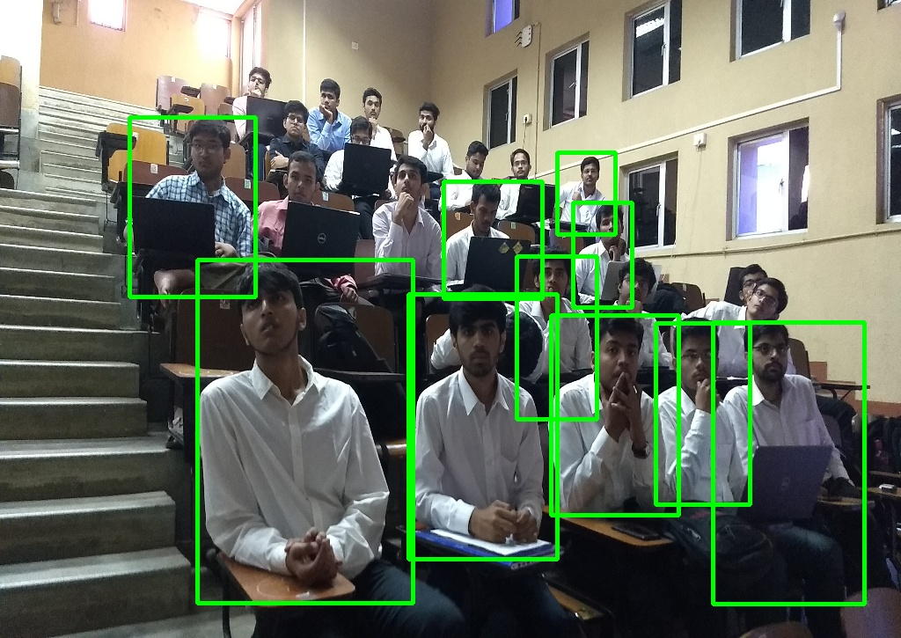
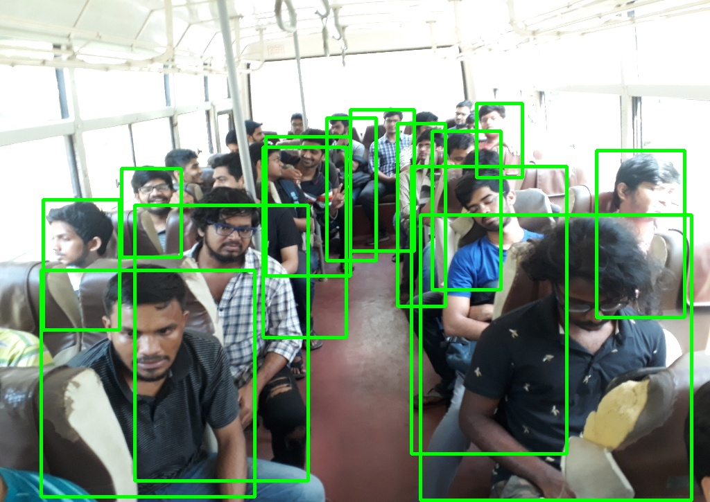
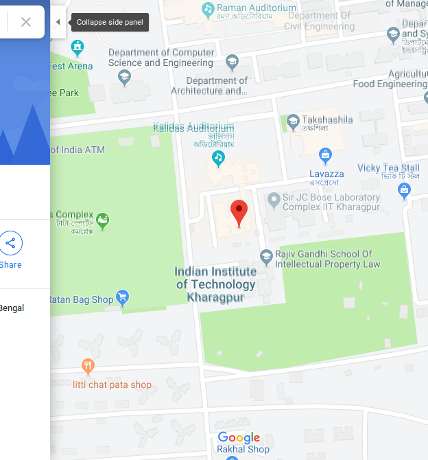
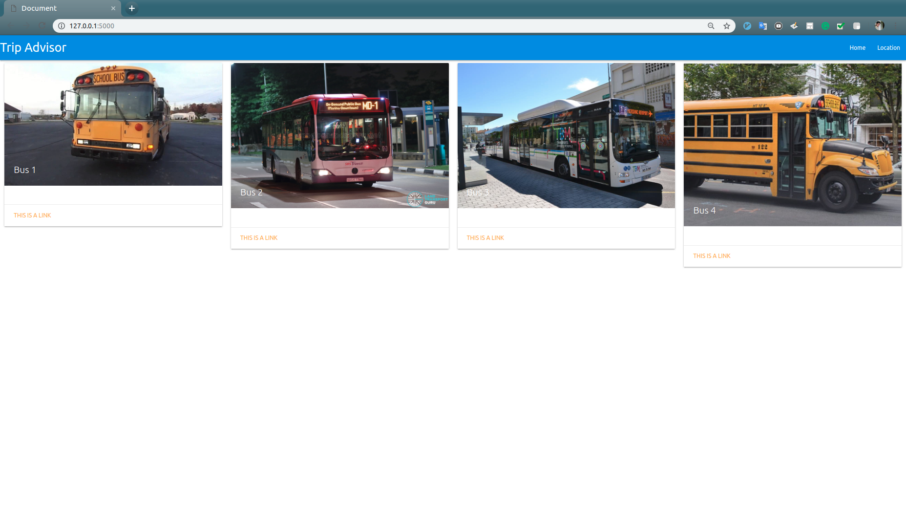
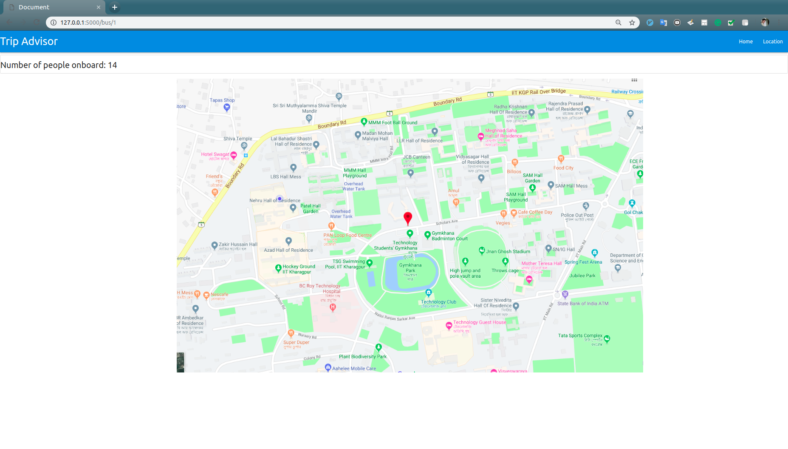

# Intelligent Bus Service

Soft Computing Tools In Engineering'19 Term Project.

<b>Team Members : </b>

Shreyas Kowshik (17MA20039)

Ayush Suhane (17MA20005)

Siddharth Lal (17MA20055)

Piyush Premchand Ranjan (17IM10012)

Saksham (17MA20035)

Given a camera feed, count the number of people in a bus using `Faster-RCNN` , get the GPS time-stamp of the picture, and update the user on where the given bus is on a map, and how many people are there in it.

<b> Link To Slides : </b> https://drive.google.com/file/d/1kCruzdLKiJjc48_8siNZbc6ogfXzxk0Q/view?usp=sharing

## Results

## Interface

## Instruction To Run

Add images to `$ROOT/static/` directory.

For `DEMO` : 

Run `python bus_demo.py`

This will generate the number of objects in each image and save the results in `$ROOT/static/`.

To run on interface : 

Run `python app.py`

## Run Cam Demo

`python cam_demo.py`

Press `q` to capture the image when the webcam window shows up.

## Run Custom Image Demo

`python custom_image_demo.py`

By default the name of the image must be `test.jpg`
